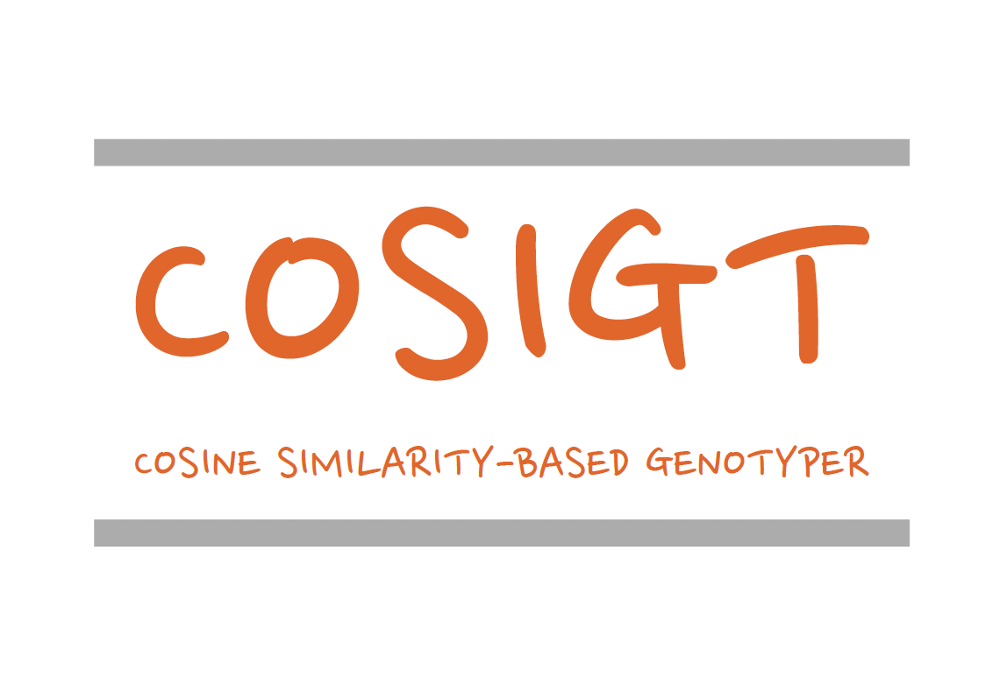

# Introduction

Cosigt (**Pronunciation:** _/koˈziː.d͡ʒi.ti/_) pipeline is an end-to-end workflow whose aim is to assign structural haplotypes to sequenced samples using pangenome graphs. 

## Contents

1. **Setup** - Initial pipeline configuration and installation instructions
   - [→ Go to Setup Guide](/setup/setup.html)
2. **Workflow** - Broad explanation of the workflow principles
   - [→ Go to Workflow Guide](/workflow/workflow.html)
3. **Use Cases** - Examples using publicly available data to demonstrate pipeline setup, input preparation and workflow functionality
   - [→ Go to Use Cases](/usecases/usecases.html)

## Citation

Refer to this manuscript if you are using our pipeline in your work:

XXX

An initial application of cosigt workflow is also presented in [this](https://www.nature.com/articles/s41586-024-07911-1) manuscript:

Bolognini, D., Halgren, A., Lou, R.N. et al. Recurrent evolution and selection shape structural diversity at the amylase locus. Nature 634, 617–625 (2024).