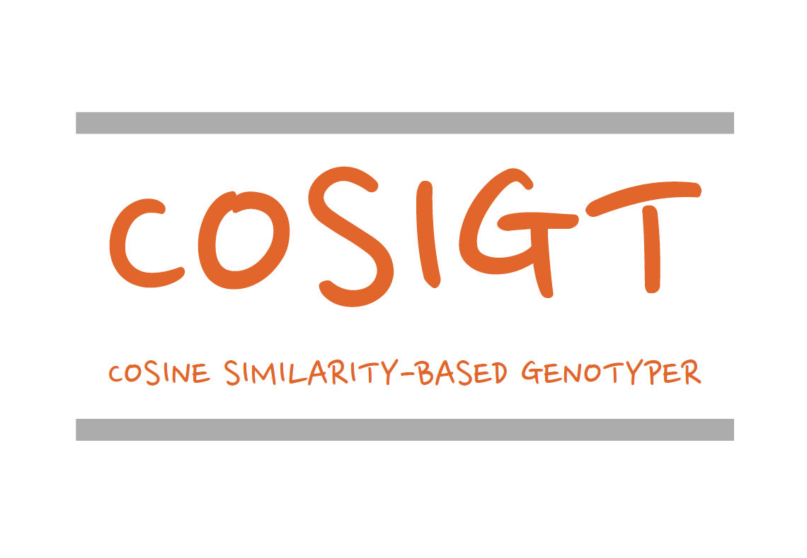

# Introduction

Cosigt (**Pronunciation:** _/koˈziː.d͡ʒi.ti/_) is an end-to-end workflow that assigns structural haplotypes to sequenced samples using pangenome graphs.

Rather than calling variants against a single linear reference, cosigt builds a local pangenome graph for each region of interest, describes every candidate haplotype by how its path traverses that graph, and then finds the combination of haplotypes whose summed coverage best explains a sample's reads. This makes it well suited to loci where a linear reference performs poorly — copy-number variable regions, large structural polymorphisms, and sequence divergent enough that reads fail to map at all.

## What is new

This documentation describes the **unified** cosigt workflow. If you have used cosigt before, the main practical differences are:

- **One branch, one configuration.** The `master`, `ancient_dna` and `custom_alleles` branches have been merged. What used to be a branch choice is now a key in `config.yaml`: `read_mode` selects short, ancient or long reads (**still experimental**), and `allele_source` selects assemblies or a curated allele panel.
- **Three commands.** `make init`, `make check`, `make run`. The `organize.py` setup script is gone; `make check` validates your configuration up front and composes the container bind mounts for you.
- **Snakemake 8/9.** Cluster execution uses executor plugins, with profiles for SLURM, LSF and generic schedulers shipped in the repository.
- **Per-region ploidy**, set in the regions BED, with genotypes enumerated correctly for any ploidy.

## Contents

1. **Setup** — installation and the three commands that drive the pipeline
   - [→ Go to Setup](/setup/setup.html)
2. **Configuration** — every input table and configuration key
   - [→ Go to Configuration](/configuration/configuration.html)
3. **Workflow** — how the pipeline works, step by step
   - [→ Go to Workflow](/workflow/workflow.html)
4. **Use Cases** — a worked end-to-end example on public data
   - [→ Go to Use Cases](/usecases/usecases.html)
5. **Benchmarking** — measuring how well the pipeline recovers known haplotypes
   - [→ Go to Benchmarking](/benchmarking/benchmarking.html)

## Citation

Refer to this manuscript if you use cosigt in your work:

Bolognini, D. et al. (2026). COSIGT: population‑scalable genotyping of complex loci from low‑coverage sequencing data using pangenome graphs. **Genome Biology** *In press*

An initial application of the cosigt workflow is presented in [this](https://www.nature.com/articles/s41586-024-07911-1) manuscript:

Bolognini, D., Halgren, A., Lou, R.N. et al. Recurrent evolution and selection shape structural diversity at the amylase locus. **Nature** 634, 617–625 (2024).
