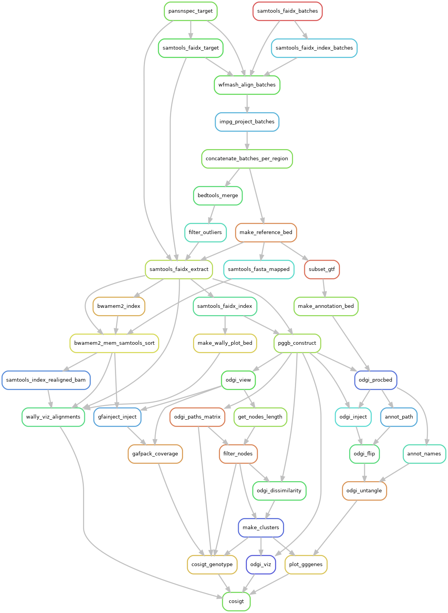

# Usage

The [rulegraph](https://snakemake.readthedocs.io/en/stable/executing/cli.html) below illustrates the COSIGT workflow:

This section provides an overview of the main steps in COSIGT, detailing the core components and their functionality. COSIGT employs a multi-step approach to structural haplotype genotyping, combining pangenome graph construction with cosine similarity-based classification:

1. [Graph Construction](#graph-construction): builds a pangenome graph from haplotype blocks using pggb, enabling variant representation across samples.
2. [Path Coverage Analysis](#path-specific-node-coverage): calculates node traversal patterns for each haplotype, creating depth matrices that capture sequence variations.
3. [Sample Projection](#sample-specific-node-coverage): maps short-read data to the graph space, generating sample-specific coverage vectors.
4. [Similarity Matching](#haplotype-deconvolution): compares sample vectors against all possible haplotype pairs using cosine similarity to identify optimal genotype matches.

## Haplotypes alignment

COSIGT begins by aligning the assembled haplotypes (queries) to their corresponding reference genome (target) using [wfmash](https://github.com/waveygang/wfmash). By default, we use `wfmash` with a mapping seed length of `10k` and a minimum percentage identity of `95%` (`-s 10k -p 95`). These parameters provide a good starting point for most analyses, but users can adjust them for specific use cases in the dedicated `wfmash` section of the `config/config.yaml` file.

## Target region liftover

Following the [initial alignment](#haplotypes-alignment), COSIGT leverages an implicit pangenome graph model - implemented in the [IMPG repository](https://github.com/pangenome/impg) - to lift over coordinates of regions of interest from the target sequence to the queries. This step allows us to identify homologous *loci* across all haplotypes that map to a specified target region. The alignment coordinates are subsequently filtered and extended to ensure comprehensive coverage of the region of interest.

## Graph construction

With the coordinates of the target regions [established](#target-region-liftover), COSIGT extracts the corresponding sequences from both the target and the queries, then uses the pangenome graph builder [PGGB](https://github.com/pangenome/pggb) to construct a local pangenome graph. In [previous work](https://www.nature.com/articles/s41586-024-07911-1), we found it beneficial to collapse regions with copy-number events into single regions of the graph. Therefore, COSIGT executes `PGGB` with the `-c` parameter set to `2` by default, which enables us to build a graph that accurately represents variation in *loci* with high copy number variation. As with `wfmash`, users can tune `PGGB` parameters in the dedicated `PGGB` section of the `config/config.yaml` file.

## Structural clustering

We implemented a strategy to identify structural clusters in the extracted haplotypes. Using the [PGGB graph](#graph-construction), we compute a [jaccard](https://en.wikipedia.org/wiki/Jaccard_index)-based distance matrix between all haplotype pairs using [ODGI](https://github.com/pangenome/odgi) `similarity` (score for each pairs ranges between `0` and `1`, with `0` = identical node traversal patterns; `1` = completely disjoint paths) and apply a clustering strategy based on [DBSCAN](https://en.wikipedia.org/wiki/DBSCAN) (`minPoints` parameter is always set to `1`, while we dinamically compute the `eps`parameter of the algorithm). This approach allows us to group haplotypes by structural similarity, providing insights into the major structural variants present in the dataset.

## Path-specific node coverage

COSIGT uses [ODGI](https://github.com/pangenome/odgi) `paths` to compute the coverage of each path over the nodes in the [graph](#graph-construction):

1. If a path crosses a certain node just once, its coverage over that node will be `1`
2. If a path does not cross a certain node, its coverage over that node will be `0`
3. If a path loops multiple times over a certain node, its coverage over that node will be `>=2`

The path coverage information is crucial for the subsequent [haplotype deconvolution](#haplotype-deconvolution) step.

## Reads-to-assembly alignment

For each sample, short-reads spanning regions of interest are fetched from the initial alignment to the linear reference and mapped against the corresponding assembly blocks. This mapping is performed using the [bwa-mem2](https://github.com/bwa-mem2/bwa-mem2) `mem` algorithm for modern genomes. For ancient genomes, we use [bwa](https://github.com/lh3/bwa) `aln` instead, with parameters optimized for ancient DNA as suggested in [this publication](https://onlinelibrary.wiley.com/doi/10.1002/ece3.8297) (`bwa aln -l 1024 -n 0.01 -o 2`). COSIGT retains alternative alignment hits to ensure comprehensive coverage of repetitive regions.
Resources allocated to the alignment step can be modified in the dedicated `bwa-mem2` and `bwa` sections of the `config/config.yaml` file.

## Sample-specific node coverage

The [alignments](#reads-to-assembly-alignment) generated in the previous step are projected onto the graph using [gfainject](https://github.com/AndreaGuarracino/gfainject). Read coverage over the graph nodes is then calculated using [gafpack](https://github.com/pangenome/gafpack.git). COSIGT incorporates the `--len-scale` parameter to normalize coverage based on node length and the `--weight-queries` parameter to account for multiple alignments of the same read, ensuring accurate representation of coverage in repetitive regions.

## Haplotype deconvolution

In the final step of COSIGT, the coverage vector of [each sample](#sample-specific-node-coverage) is compared to a set of pre-computed coverage vectors. These reference vectors are generated by pairing all [path](#path-specific-node-coverage) vectors over the graph. The comparison is performed using [cosine similarity](https://en.wikipedia.org/wiki/Cosine_similarity), which measures the similarity between two vectors as their dot product divided by the product of their lengths. The haplotype pair with the highest similarity to the short-read vector is assigned as the genotype for each sample in each genomic region.
For haploid regions, the same principle applies, but the sample coverage vector is compared to each individual path coverage vector rather than pairs.

## Parallelization

COSIGT is designed to efficiently utilize available computational resources through extensive parallelization:

1. The [assembly-to-reference alignment](#haplotypes-alignment) runs in parallel for each chromosome and each assembly sample. COSIGT requires assembled haplotypes to follow the [PanSN](https://github.com/pangenome/PanSN-spec) specification (`sample#haplotype#contig`) - a requirement verified during the [preliminary setup](/setup/setup.html). All haplotypes sharing the same assembly sample identifier are aligned to their corresponding reference chromosome in a single process. For example, with contigs from 10 different assembly samples and regions from 2 different chromosomes, COSIGT can spawn up to 20 concurrent processes during this alignment step.
2. The [target region liftover](#target-region-liftover) process from target sequences to assembled haplotypes operates in parallel for each assembly sample and each region, further enhancing performance when processing diverse genomic regions.
3. The different graph analysis operations run in parallel by region, including:
   - [Graph construction from assembled contigs](#graph-construction)
   - [Structural haplotype clustering](#structural-clustering)
   - [Computation of coverage along graph paths](#path-specific-node-coverage)
4. The Sequencing Sample Processing stages of COSIGT are parallelized by both sequencing sample and region:
   - [Short-read alignment to assembled contigs](#reads-to-assembly-alignment)
   - [Projection of short-read alignments into graph space](#sample-specific-node-coverage)
   - [Haplotype deconvolution and genotyping of sequencing samples](#haplotype-deconvolution)

This multi-level parallelization strategy enables efficient processing of large cohorts with complex genomic regions, maximizing throughput on high-performance computing infrastructure.