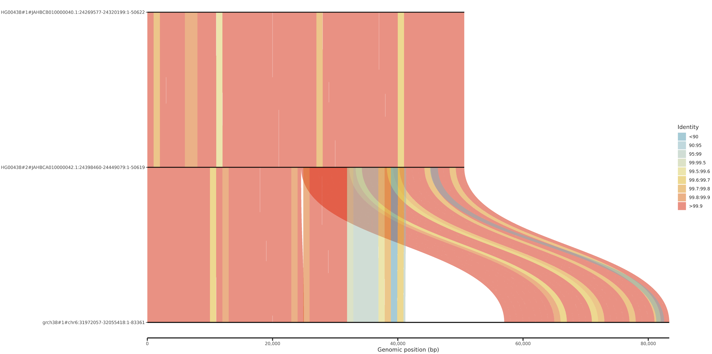
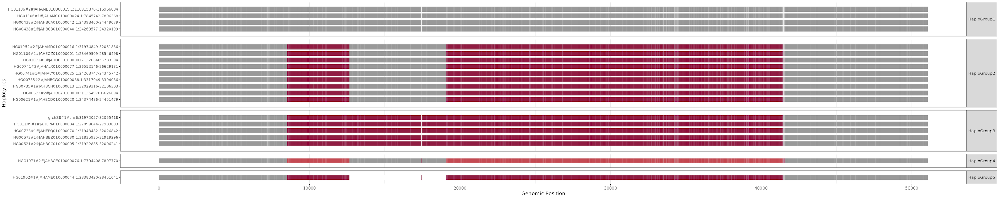
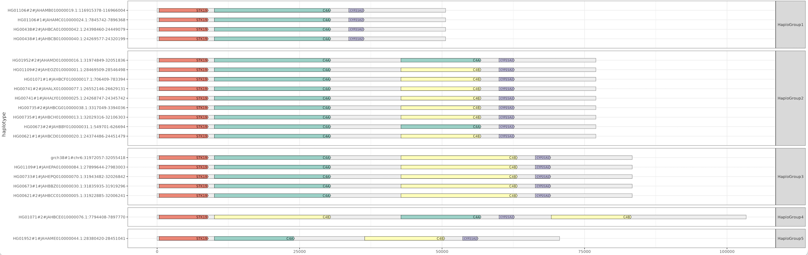
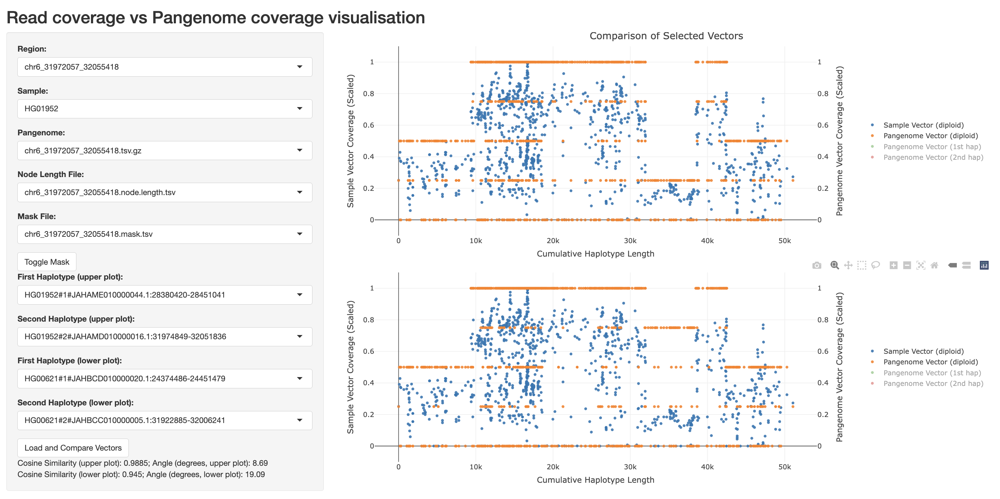

# Use Cases

This section provides a comprehensive end-to-end example of how to run the [cosigt](https://github.com/davidebolo1993/cosigt) pipeline. The rationale of the pipeline is explained in greater detail in the [→ workflow section](/workflow/workflow.html).

## Data Acquisition

We create a minimal test dataset to demonstrate cosigt functionality using publicly available data. Let's start by creating a test directory:

```bash
mkdir cosigt_test
cd cosigt_test
```

### Required Tools

Several tools are necessary to complete the following sections. The most straightforward approach is to install them using [conda](https://docs.conda.io/projects/conda/en/latest/index.html) or similar package managers, as shown below.

```bash
micromamba create \
    -p use_cases_env \
    -c bioconda \
    -c conda-forge \
    samtools \
    odgi \
    agc \
    mash \
    bedtools
micromamba activate $PWD/use_cases_env
```

### Sequencing Reads

The cosigt pipeline requires sequencing reads previously aligned to a reference genome in standard [bam](https://samtools.github.io/hts-specs/SAMv1.pdf) or [cram](https://samtools.github.io/hts-specs/CRAMv3.pdf) format. We can obtain suitable alignment files from the [1000 Genomes Project](https://www.internationalgenome.org/data-portal/data-collection/30x-grch38):

```bash
mkdir alignments
cd alignments
# Download the complete sample index
wget https://ftp-trace.ncbi.nlm.nih.gov/1000genomes/ftp/1000G_2504_high_coverage/additional_698_related/1000G_698_related_high_coverage.sequence.index
# Select a couple of samples
grep -E "HG00438|HG01952" 1000G_698_related_high_coverage.sequence.index | cut -f 1 > 1000G.selected.txt
# Add their index files
sed 's/$/.crai/' 1000G.selected.txt >> 1000G.selected.txt
# Download the selected files
wget -i 1000G.selected.txt
cd ..
```

### Reference Genome

A reference genome is required for two purposes: extracting region-specific reads from the original alignments (if in cram format) and serving as one of the assemblies against which samples are compared. In this example, reads are aligned to [GRCh38](https://ftp.1000genomes.ebi.ac.uk/vol1/ftp/technical/reference/GRCh38_reference_genome/):

```bash
mkdir reference
cd reference
# Download the reference genome
wget ftp://ftp.1000genomes.ebi.ac.uk/vol1/ftp/technical/reference/GRCh38_reference_genome/GRCh38_full_analysis_set_plus_decoy_hla.fa
# Download its index
wget ftp://ftp.1000genomes.ebi.ac.uk/vol1/ftp/technical/reference/GRCh38_reference_genome/GRCh38_full_analysis_set_plus_decoy_hla.fa.fai
cd ..
```

### Genome Assemblies

The cosigt pipeline begins with individual haplotypes to construct pangenome graphs of regions targeted for genotyping. Our workflow expects haplotypes to be grouped by their corresponding reference chromosome. Below are two alternative strategies for generating such chromosome-specific assemblies, which users can choose based on their available data.

#### Option 1: Starting from a Chromosome-Specific Graph

One approach is to extract haplotypes for specific chromosomes from existing chromosome-specific pangenome graphs. For example, [Year 1](https://github.com/human-pangenomics/HPP_Year1_Assemblies) of the [Human Pangenome Reference Consortium (HPRC)](https://humanpangenome.org/) provides [such data](https://s3-us-west-2.amazonaws.com/human-pangenomics/index.html?prefix=pangenomes/freeze/freeze1/pggb/chroms/). We'll limit our analysis to `chr4` and `chr6` since these contain our [regions of interest](#regions-of-interest):

```bash
mkdir assemblies_a
cd assemblies_a
# Download chromosome-specific pangenome graphs
wget https://s3-us-west-2.amazonaws.com/human-pangenomics/pangenomes/freeze/freeze1/pggb/chroms/chr4.hprc-v1.0-pggb.gfa.gz
wget https://s3-us-west-2.amazonaws.com/human-pangenomics/pangenomes/freeze/freeze1/pggb/chroms/chr6.hprc-v1.0-pggb.gfa.gz
# Download AGC (Assembly Graph Container)
wget https://zenodo.org/record/5826274/files/HPRC-yr1.agc?download=1 -O HPRC-yr1.agc 
# Process each chromosome to subset HG00438, HG01952, plus 8 additional samples
for chr in chr4 chr6; do
    # Extract all contig IDs
    zgrep "^P" "$chr.hprc-v1.0-pggb.gfa.gz" | cut -f2 | sort -u > "${chr}.all_ids.txt"
    # Subset to our samples of interest
    grep -E "^HG00438#|^HG01952#" "${chr}.all_ids.txt" > "${chr}.subset.txt"
    # Add 8 additional samples for diversity
    grep -v -E "^HG00438#|^HG01952#" "${chr}.all_ids.txt" \
        | cut -d'#' -f1 \
        | sort -u \
        | head -n 8 \
        | while read id; do grep "^$id#" "${chr}.all_ids.txt"; done >> "${chr}.subset.txt"
    rm "${chr}.all_ids.txt"
    # Extract FASTA sequences
    cat "${chr}.subset.txt" | while read f; do
        agc getctg HPRC-yr1.agc $f | bgzip -@ 8 >> "${chr}.subset.fasta.gz"
    done
    rm "${chr}.subset.txt"
    # Index the FASTA file
    samtools faidx "${chr}.subset.fasta.gz"
done
cd ..
```

::: tip
This represents just one possible strategy for subsetting assemblies from chromosome-specific pangenome graphs. Alternatively, you can subset the initial .gfa to paths of interest using `odgi paths -i GRAPH.GFA -K PATHS.TXT -o SUBGRAPH.OG` and then extract the assemblies as FASTA from the subgraph with `odgi paths -i SUBGRAPH.OG -f > SUBSET.FASTA`. 
:::

#### Option 2: Starting from Individual Haplotypes

An alternative approach is to determine which reference chromosome each sample-specific haplotype most likely belongs to using [Mash distances](https://genomebiology.biomedcentral.com/articles/10.1186/s13059-016-0997-x). This method doesn't require chromosome-specific graphs and can start directly from individual assemblies:

```bash
mkdir assemblies_b
cd assemblies_b
# Reference to AGC from previous step
agc="../assemblies_a/HPRC-yr1.agc"
# Extract individual IDs
ids=$(cut -d "#" -f 1,2 ../assemblies_a/*fai | sed 's/#/./g' | sort | uniq)
# Download corresponding FASTA files
for id in $ids; do
    agc getset $agc $id | bgzip -@ 8 > $id.fasta.gz
    samtools faidx $id.fasta.gz
done
# Create a sketch of the reference
mash sketch -s 100000 -p 8 -i ../reference/GRCh38_full_analysis_set_plus_decoy_hla.fa
for id in $ids; do
    # Calculate distances (each contig vs reference chromosomes)
    mash dist ../reference/GRCh38_full_analysis_set_plus_decoy_hla.fa.msh "$id.fasta.gz" -i -s 100000 -p 8 > "$id.tsv"
    # Identify contigs with chr4/chr6 as best matches
    cut -f 2 "$id.tsv" | sort -u | while read f; do
        best=$(grep -w "$f" "$id.tsv" | sort -k3n | head -1)
        chr=$(echo "$best" | awk '{print $1}')
        hap=$(echo "$best" | awk '{print $2}')
        if [[ "$chr" == "chr4" || "$chr" == "chr6" ]]; then
            samtools faidx "$id.fasta.gz" "$hap" | bgzip -@ 8 >> "${chr}.subset.fasta.gz"
        fi
    done
    rm "$id.tsv"
done
# Index the resulting chromosome-specific files
for chr in chr4 chr6; do
    samtools faidx "${chr}.subset.fasta.gz"
done
```

### Regions of Interest

One final piece of information required for the pipeline is a list of target regions located on the chromosomes for which we have assemblies (chromosomes 6 and 4 in this example). Notable examples include the [C4](https://en.wikipedia.org/wiki/Complement_component_4) and [GYPA](https://en.wikipedia.org/wiki/Glycophorin_A) loci:

```bash
mkdir regions
cd regions
# GYPA region
echo -e "chr4\t144109303\t144140751\tGYPA" > roi.bed
# C4 region
echo -e "chr6\t31972057\t32055418\tC4" >> roi.bed
cd ..
```

### Annotations (optional)

You can optionally provide gene annotation and protein translation files to the pipeline. If supplied, the pipeline will build gene graphs using [pangene](https://github.com/lh3/pangene) allowing gene projection onto the assemblies for the regions of interest.

```bash
mkdir annotations
cd annotations
# Download GTF annotation
wget https://ftp.ebi.ac.uk/pub/databases/gencode/Gencode_human/release_48/gencode.v48.annotation.gtf.gz
# Download and index protein-coding transcript translations
wget https://ftp.ebi.ac.uk/pub/databases/gencode/Gencode_human/release_48/gencode.v48.pc_translations.fa.gz
gzip -d gencode.v48.pc_translations.fa.gz
bgzip gencode.v48.pc_translations.fa
samtools faidx gencode.v48.pc_translations.fa.gz
cd ..
```

### Haplotype exclusion (optional)

You may optionally provide a list of regions identified by [flagger](https://github.com/mobinasri/flagger) in BED format to exclude potentially misassembled haplotype blocks from downstream analyses. The following strategy downloads the Flagger index and corresponding BED files for our assemblies of interest, then generates a unified exclusion file:

```bash
mkdir flagger
cd flagger
# Download Flagger index
wget https://raw.githubusercontent.com/human-pangenomics/HPP_Year1_Assemblies/12656b82a42cd4ec6d421abe7fd4ebdeca74b41c/annotation_index/Year1_assemblies_v2_genbank_Flagger.index
# Extract assembly names and download corresponding BEDs
cut -f 1 ../assemblies_a/*fai | cut -d "#" -f 1 | sort | uniq | while read f; do
    link=$(grep -w $f Year1_assemblies_v2_genbank_Flagger.index | cut -f 2)
    clink=$(echo $link | sed 's,s3://,https://s3-us-west-2.amazonaws.com/,')
    wget $clink
done
# Merge and sort all exclusion regions
cut -f 1-3 *bed | bedtools sort -i - > flagger.exclude.bed
cd ..
```

### Clone cosigt Repository

Clone the cosigt repository from [GitHub](https://github.com/davidebolo1993/cosigt).
```bash
micromamba activate smk7324app132
git clone https://github.com/davidebolo1993/cosigt
cd cosigt
```
For the environment setup, refer to the [→ setup section](/setup/setup.html). 

## Configure and run the workflow (`master` and `ancient_dna` branches)

With all necessary data prepared, we can now configure the pipeline using the [dedicated setup script](https://github.com/davidebolo1993/cosigt/blob/master/cosigt_smk/workflow/scripts/organize.py). The `organize.py` script of the `master` and `ancient_dna` branches of the pipeline accepts the arguments listed below:

```bash
# Confirm you're on the master branch
git rev-parse --abbrev-ref HEAD
# Should return 'master'
cd cosigt_smk
python workflow/scripts/organize.py -h
```

```txt
COsine SImilarity-based GenoTyper

optional arguments:
  -h, --help            show this help message and exit

Required I/O arguments:
  -a FASTA, --assemblies FASTA
                        assemblies individuals to -r will be genotyped against. This is a tab-separated file mapping chromosomes in -b to a FASTA with contigs for that chromosome. FASTA can be bgzip-compressed and must be indexed
  -g FASTA, --genome FASTA
                        reference genome. This is the FASTA regions to -b refers to. FASTA can be bgzip-compressed and must be indexed
  -r FOLDER, --reads FOLDER
                        individuals to genotype. This is a folder with individual reads aligned to a reference genome (same to -g) in BAM/CRAM format. Alignment files must be indexed (BAI,CSI/CRAI) and will be searched recursively
  -b BED, --bed BED     regions to genotype. A standard 3-column BED file, but can have a 4th column to label the region and a
                        5th column listing comma-separated alternative contigs for that region
  -o FOLDER, --output FOLDER
                        output folder. This is where results from cosigt pipeline will be stored

Optional arguments:
  --map                 tab-separated file mapping each alignment file (1st column) to an id (2nd column). Guess the name removing file extension otherwise [None]
  --gtf                 Gene annotation on the reference chromosomes in GTF format [None]
  --proteins            Protein-coding transcript translation sequences in FASTA format. FASTA can be bgzip-compressed and must be indexed [None]
  --tmp                 tmp directory. Will be used by tools for which a tmp directory can be specified [/tmp]
  --pansn               PanSN prefix naming for the reference genome [grch38#1#]
  --profile             snakemake profile, if available [None]
  --blacklist           list of contigs to blacklist - these will not be used during genotyping [None]
  --flagger             regions to exclude for each contigs. This is a standard BED file coming from flagger, with contigs names matching those of the assemblies in -a [None]
  --conda               prepare for running using conda instead of singularity [False]
  --threads             run snakemake using that many cores - ignored if using a profile [32]
```

For the current use-case, inputs to `organize.py` are the following:

```bash
# Assemblies map
> ../../asm_map.tsv
for f in ../../assemblies_a/*.fasta.gz; do
    id=$(basename "$f" | cut -d "." -f 1)
    echo -e "$id\t$f" >> ../../asm_map.tsv
done
assemblies=$(readlink -f ../../asm_map.tsv)
# Reference genome
genome=$(readlink -f ../../reference/GRCh38_full_analysis_set_plus_decoy_hla.fa)
# Read alignments
reads=$(readlink -f ../../alignments)
# Genotyping regions
bed=$(readlink -f ../../regions/roi.bed)
# Output directory
output=$(readlink -f $PWD/cosigt_results)
# Sample map (optional)
> ../../sample_map.tsv
for s in ../../alignments/*.cram; do
    id=$(basename "$s" | cut -d "." -f 1)
    echo -e "$s\t$id" >> ../../sample_map.tsv
done
map=$(readlink -f ../../sample_map.tsv)
# GTF (optional)
gtf=$(readlink -f ../../annotations/gencode.v48.annotation.gtf.gz)
# Proteins FASTA (optional)
proteins=$(readlink -f ../../annotations/gencode.v48.pc_translations.fa.gz)
# Flagger exclusion (optional)
flagger=$(readlink -f ../../flagger/flagger.exclude.bed)
```

This generates in the current working directory (`cosigt/cosigt_smk`):

- the `resources` folder
- the `config/config.yaml` file
- the `cosigt_smk.sh` script

In `resources` input files are re-organized so that the pipeline knows exactly where they are located. They follow the structure below:

```bash
tree resources
```
```txt
resources/
|-- alignments
|   |-- HG00438.cram -> /group/soranzo/davide.bolognini/working/dev/cosigt_test/alignments/HG00438.final.cram
|   |-- HG00438.cram.crai -> /group/soranzo/davide.bolognini/working/dev/cosigt_test/alignments/HG00438.final.cram.crai
|   |-- HG01952.cram -> /group/soranzo/davide.bolognini/working/dev/cosigt_test/alignments/HG01952.final.cram
|   `-- HG01952.cram.crai -> /group/soranzo/davide.bolognini/working/dev/cosigt_test/alignments/HG01952.final.cram.crai
|-- annotations
|   |-- gencode.v48.annotation.gtf.gz -> /group/soranzo/davide.bolognini/working/dev/cosigt_test/annotations/gencode.v48.annotation.gtf.gz
|   |-- gencode.v48.pc_translations.fa.gz -> /group/soranzo/davide.bolognini/working/dev/cosigt_test/annotations/gencode.v48.pc_translations.fa.gz
|   |-- gencode.v48.pc_translations.fa.gz.fai -> /group/soranzo/davide.bolognini/working/dev/cosigt_test/annotations/gencode.v48.pc_translations.fa.gz.fai
|   `-- gencode.v48.pc_translations.fa.gz.gzi -> /group/soranzo/davide.bolognini/working/dev/cosigt_test/annotations/gencode.v48.pc_translations.fa.gz.gzi
|-- assemblies
|   |-- chr4
|   |   |-- chr4.subset.fasta.gz -> /group/soranzo/davide.bolognini/working/dev/cosigt_test/assemblies_a/chr4.subset.fasta.gz
|   |   |-- chr4.subset.fasta.gz.fai -> /group/soranzo/davide.bolognini/working/dev/cosigt_test/assemblies_a/chr4.subset.fasta.gz.fai
|   |   `-- chr4.subset.fasta.gz.gzi -> /group/soranzo/davide.bolognini/working/dev/cosigt_test/assemblies_a/chr4.subset.fasta.gz.gzi
|   `-- chr6
|       |-- chr6.subset.fasta.gz -> /group/soranzo/davide.bolognini/working/dev/cosigt_test/assemblies_a/chr6.subset.fasta.gz
|       |-- chr6.subset.fasta.gz.fai -> /group/soranzo/davide.bolognini/working/dev/cosigt_test/assemblies_a/chr6.subset.fasta.gz.fai
|       `-- chr6.subset.fasta.gz.gzi -> /group/soranzo/davide.bolognini/working/dev/cosigt_test/assemblies_a/chr6.subset.fasta.gz.gzi
|-- blacklist
|   `-- blacklist.txt
|-- flagger
|   `-- flagger_blacklist.bed
|-- reference
|   |-- GRCh38_full_analysis_set_plus_decoy_hla.fa -> /group/soranzo/davide.bolognini/working/dev/cosigt_test/reference/GRCh38_full_analysis_set_plus_decoy_hla.fa
|   `-- GRCh38_full_analysis_set_plus_decoy_hla.fa.fai -> /group/soranzo/davide.bolognini/working/dev/cosigt_test/reference/GRCh38_full_analysis_set_plus_decoy_hla.fa.fai
`-- regions
    |-- all_regions.tsv
    |-- chr4
    |   `-- chr4_144109303_144140751.bed
    `-- chr6
        `-- chr6_31972057_32055418.bed
```

`config/config.yaml` defines resources for pipeline components. For example:

```bash
grep "pggb" config/config.yaml
```
```json
#used by pggb
pggb: {mem_mb: 20000, params: -c 2, threads: 24, time: 40, tmpdir: /tmp}
```

This configures `pggb` to run with 20GB RAM, 24 threads, and 40 minutes time limit using `/tmp` as a working directory. Resources can be tuned by users based on those available. 
`cosigt_smk.sh` script launches the pipeline. By default, the pipeline will be launched using Singularity for tools. Since we haven’t passed a `--profile`, the workflow will execute locally.
To run on a SLURM cluster, pass the profile path (see  the [→ setup section](/setup/setup.html) for details on how to build an example profile for SLURM). 

```bash
# Clean resources
rm -rf resources
# Run organize.py
python workflow/scripts/organize.py \
    -a $assemblies \
    -g $genome \
    -r $reads \
    -b $bed \
    -o $output \
    --map $map \
    --gtf $gtf \
    --proteins $proteins \
    --flagger $flagger \
    --profile config/slurm
```

The entire workflow can then be run with `sh cosigt_smk.sh`. Users may want to refine the regions provided to `--bed` using the [refine](#refine-workflow) mode od cosigt. This is not required for with the current example.

## Exploring Results

Following, an overview of the primary outputs produced by the cosigt pipeline

### Genotyping Results

Cosigt performs `haplotype deconvolution`, identifying the combination of haplotypes from the pangenome that best matches the short-read sequencing data for a given region. Details on this step are described in the [→ workflow section](/workflow/workflow.html).
After running the pipeline, genotyping outputs are stored under:

```bash
tree cosigt_results/cosigt
```
```txt
cosigt_results/cosigt/
|-- HG00438
|   |-- chr4
|   |   `-- chr4_144109303_144140751
|   |       |-- chr4_144109303_144140751.cosigt_genotype.tsv
|   |       |-- chr4_144109303_144140751.sorted_combos.tsv.gz
|   |       `-- viz
|   |           |-- chr4_144109303_144140751.ava.png
|   |           |-- HG00438#1_to_grch38#1#chr4.png
|   |           `-- HG00438#2_to_grch38#1#chr4.png
|   `-- chr6
|       `-- chr6_31972057_32055418
|           |-- chr6_31972057_32055418.cosigt_genotype.tsv
|           |-- chr6_31972057_32055418.sorted_combos.tsv.gz
|           `-- viz
|               |-- chr6_31972057_32055418.ava.png
|               |-- HG00438#1_to_grch38#1#chr6.png
|               `-- HG00438#2_to_grch38#1#chr6.png
`-- HG01952
    |-- chr4
    |   `-- chr4_144109303_144140751
    |       |-- chr4_144109303_144140751.cosigt_genotype.tsv
    |       |-- chr4_144109303_144140751.sorted_combos.tsv.gz
    |       `-- viz
    |           |-- chr4_144109303_144140751.ava.png
    |           |-- HG01952#1_to_grch38#1#chr4.png
    |           `-- HG01952#2_to_grch38#1#chr4.png
    `-- chr6
        `-- chr6_31972057_32055418
            |-- chr6_31972057_32055418.cosigt_genotype.tsv
            |-- chr6_31972057_32055418.sorted_combos.tsv.gz
            `-- viz
                |-- chr6_31972057_32055418.ava.png
                |-- HG01952#1_to_grch38#1#chr6.png
                `-- HG01952#2_to_grch38#1#chr6.png

```

Each region directory contains:
-  `*.cosigt_genotype.tsv`: best-matching haplotype pair (`haplotype.1`, `haplotype.2`) selected to maximize the [cosine similarity](https://en.wikipedia.org/wiki/Cosine_similarity) to the sample.
- `*.sorted_combos.tsv.gz`: cosine similarity scores for all tested haplotype combinations.
- `viz/`: visualizations of alignments between predicted haplotypes and the reference.
One example for `HG00438` at the C4 locus (`chr6_31972057_32055418`):

[](./ava.png)

In this case, both predicted haplotypes (`HG00438#1`, `HG00438#2`) are structurally similar to each other but diverge from the reference (`grch38#chr6`), due to a duplication absent in the predicted haplotypes.

### Structural Clustering

To summarize major structural variation patterns, cosigt performs clustering of haplotypes based on graph similarity (see the [→ workflow section](/workflow/workflow.html)). Outputs are stored in:

```bash
tree cosigt_results/cluster
```
```txt
cosigt_results/cluster/
|-- chr4
|   `-- chr4_144109303_144140751
|       |-- chr4_144109303_144140751.clusters.hapdist.norm.tsv
|       |-- chr4_144109303_144140751.clusters.hapdist.tsv
|       |-- chr4_144109303_144140751.clusters.json
|       |-- chr4_144109303_144140751.clusters.medoids.tsv
|       |-- chr4_144109303_144140751.clusters.metrics.tsv
|       `-- chr4_144109303_144140751.clusters.tsv
`-- chr6
    `-- chr6_31972057_32055418
        |-- chr6_31972057_32055418.clusters.hapdist.norm.tsv
        |-- chr6_31972057_32055418.clusters.hapdist.tsv
        |-- chr6_31972057_32055418.clusters.json
        |-- chr6_31972057_32055418.clusters.medoids.tsv
        |-- chr6_31972057_32055418.clusters.metrics.tsv
        `-- chr6_31972057_32055418.clusters.tsv
```

File descriptions:
- `*.clusters.tsv`/`*.clusters.json`: assigned `haplotype.group` per `haplotype.name` (TSV and JSON formats).
- `*.clusters.hapdist.tsv`: pairwise haplotype distances between groups.
- `*.clusters.hapdist.norm.tsv`: normalized version of the above (scaled to max pairwise distance).
- `*.clusters.medoids.tsv`: representative haplotype (medoid) for each group.
- `*.clusters.metrics.tsv`: clustering parameters (e.g., eps) used.

Visualizations of clusters can be found in `cosigt_test/odgi/viz/{chromosome}/{region}`. An example for the C4 locus:

[](./viz.png)

Nodes are oriented relative to the reference (`grch38#1#chr6`) and colored by path coverage (based on the [Spectral-11](https://loading.io/color/feature/Spectral-11/) palette). Haplotypes are grouped and ordered by cluster, facilitating visual comparison of structural similarity.

### Genes annotation

If gene annotations and protein sequences were provided, cosigt uses pangene to build gene graphs and project annotations onto the assemblies. An example visualization for the C4 locus:

[](./pangene.png)

### Interactive plot of genotyping results

The cosigt pipeline includes an interactive [visualization tool](https://github.com/davidebolo1993/cosigt/blob/master/cosigt_smk/workflow/scripts/app.r) that enables dynamic exploration of genotyping outcomes across samples and regions. You can launch the app as follows:

```bash
cd workflow/scripts
bash runapp.sh ../../cosigt_test
#Listening on http://0.0.0.0:3838
```

Then, open your web browser and navigate to `http://0.0.0.0:3838` to view the results. For example:

[](./app.png)

The app primarily visualizes short-read coverage (`Sample Vector Coverage`, blue dots, left y-axis) versus haplotype coverage (`Pangenome Vector Coverage`, orange dots, right y-axis) across graph nodes (`Cumulative Haplotype Length`, x-axis). Each dot represents a graph node, and the `Cumulative Haplotype Length` accounts for the length of each node.
For each region of interest (selectable via the `Region` menu) and sample (via the `Sample` menu), you can display up to two short-read vs haplotype coverage comparisons: the first in the upper panel and the second in the lower panel. This allows you to compare the cosigt genotyping prediction against the expected haplotype coverage, helping to identify matches or coverage anomalies.

## Configure and run the workflow (`custom_allels` branch)

As an alternative to running from raw assemblies, cosigt can also be launched directly from a predefined set of alleles — for example, those generated in a previous run:

```bash
tree cosigt_results/bedtools/getfasta
```
```txt
cosigt_results/bedtools/getfasta/
|-- chr4
|   `-- chr4_144109303_144140751
|       |-- chr4_144109303_144140751.fasta.gz
|       |-- chr4_144109303_144140751.fasta.gz.fai
|       `-- chr4_144109303_144140751.fasta.gz.gzi
`-- chr6
    `-- chr6_31972057_32055418
        |-- chr6_31972057_32055418.fasta.gz
        |-- chr6_31972057_32055418.fasta.gz.fai
        `-- chr6_31972057_32055418.fasta.gz.gzi
```

To use this mode, switch to the `custom_alleles` branch:

```bash
cd ../
git checkout custom_alleles
cd cosigt_smk
python workflow/scripts/organize.py -h
```

The script accepts a similar set of arguments to the `master` and `ancient_dna` branches. The key difference lies in the `-a` argument, which now expects a TSV mapping each region to its corresponding allele FASTA file (can be bgzipped). Example:

```bash
> ../../all_map.tsv
for f in cosigt_results/bedtools/getfasta/*/*/*gz; do
    id=$(basename $(dirname $f))
    echo -e "$id\t$f" >> ../../all_map.tsv
done
```

Then run:

```bash
# Clean previous resources
rm -rf resources
# Alleles
alleles=$(readlink -f ../../all_map.tsv)
# New output directory
output=$(readlink -f $PWD/cosigt_results_alleles)
# Launch organize.py
python workflow/scripts/organize.py \
    -a $alleles \
    -g $genome \
    -r $reads \
    -b $bed \
    -o $output \
    --map $map \
    --gtf $gtf \
    --proteins $proteins \
    --flagger $flagger \
    --profile config/slurm
```

And finally:

```bash
sh cosigt_smk.sh
```

The output structure and interpretation remain identical to those described in the [previuos sections](#exploring-results). 

## Refine Workflow

In addition to the main **cosigt** workflow, our Snakemake pipeline also supports a **refine** mode (available in both the `master` and `ancient_dna` branches).  
This mode attempts to dynamically extend the input regions at both flanks to retain as many haplotypes as possible during the `impg` step, up to a configurable extension threshold (default: ±60 kb).
To run the refine workflow, simply replace `"cosigt"` with `"refine"` in the `cosigt_smk.sh` script.
The output is a BED file containing the refined regions in `cosigt_results/refine/regions_refined.bed`. 
This refined BED file can then be used as input for a new cosigt run by replacing the original regions BED file.  
If you reuse the same output directory (`--output`), the pipeline will skip the initial query-to-target alignment step, recycling those generated in the `refine` mode.