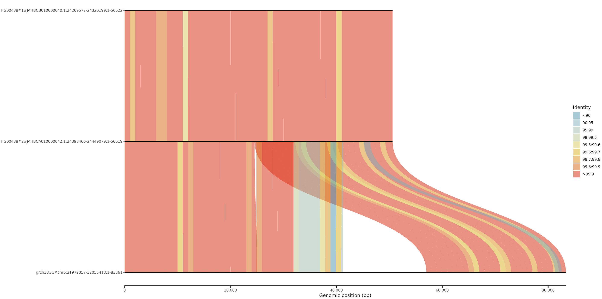
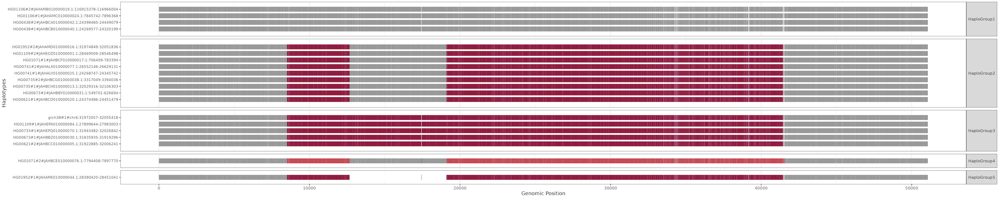
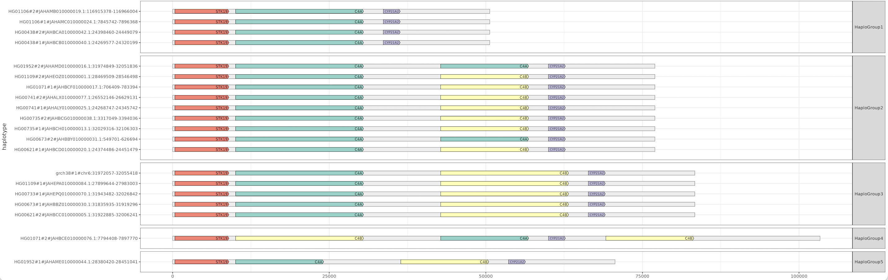
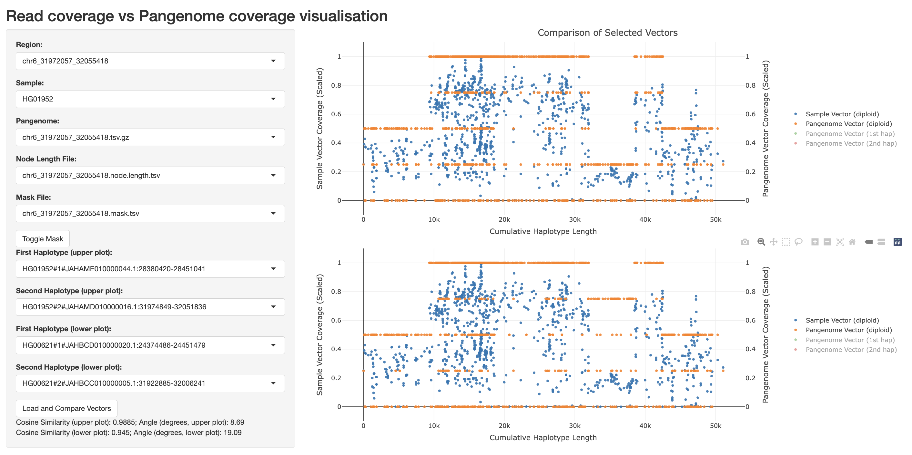

# Use Cases

This section provides an end-to-end example of running the [cosigt](https://github.com/davidebolo1993/cosigt) pipeline on publicly available data. The rationale behind each step is explained in the [→ Workflow](/workflow/workflow.html) section, and every configuration key in [→ Configuration](/configuration/configuration.html).

We will genotype two 1000 Genomes samples at the [C4](https://en.wikipedia.org/wiki/Complement_component_4) and [GYPA](https://en.wikipedia.org/wiki/Glycophorin_A) loci against HPRC assemblies, then look at the outputs, and finally show the variants of the same run: custom alleles, long reads, and benchmarking.

## Data acquisition

```bash
mkdir cosigt_test
cd cosigt_test
```

### Required tools

These are needed only to *prepare* the inputs; the pipeline itself brings its own tools via containers or conda.

```bash
micromamba create \
    -p use_cases_env \
    -c bioconda -c conda-forge \
    samtools odgi agc mash bedtools
micromamba activate $PWD/use_cases_env
```

### Sequencing reads

Cosigt takes reads already aligned to a reference genome, in [BAM](https://samtools.github.io/hts-specs/SAMv1.pdf) or [CRAM](https://samtools.github.io/hts-specs/CRAMv3.pdf) format, indexed. We use two samples from the [1000 Genomes Project](https://www.internationalgenome.org/data-portal/data-collection/30x-grch38):

```bash
mkdir alignments && cd alignments
wget https://ftp-trace.ncbi.nlm.nih.gov/1000genomes/ftp/1000G_2504_high_coverage/additional_698_related/1000G_698_related_high_coverage.sequence.index
grep -E "HG00438|HG01952" 1000G_698_related_high_coverage.sequence.index | cut -f 1 > 1000G.selected.txt
sed 's/$/.crai/' 1000G.selected.txt >> 1000G.selected.txt
wget -i 1000G.selected.txt
cd ..
```

### Reference genome

Needed to extract region-specific reads from CRAM, and as one of the sequences in the graph:

```bash
mkdir reference && cd reference
wget ftp://ftp.1000genomes.ebi.ac.uk/vol1/ftp/technical/reference/GRCh38_reference_genome/GRCh38_full_analysis_set_plus_decoy_hla.fa
wget ftp://ftp.1000genomes.ebi.ac.uk/vol1/ftp/technical/reference/GRCh38_reference_genome/GRCh38_full_analysis_set_plus_decoy_hla.fa.fai
cd ..
```

### Genome assemblies

Cosigt builds its graphs from individual haplotypes, grouped by reference chromosome and named following the [PanSN](https://github.com/pangenome/PanSN-spec) specification (`sample#haplotype#contig`). Two ways to obtain them are shown in the original release notes; the short version, extracting from the [HPRC](https://humanpangenome.org/) year-1 chromosome graphs for the two chromosomes we need:

```bash
mkdir assemblies && cd assemblies
for chr in chr4 chr6; do
    wget https://s3-us-west-2.amazonaws.com/human-pangenomics/pangenomes/freeze/freeze1/pggb/chroms/${chr}.hprc-v1.0-pggb.gfa.gz
    odgi build -g ${chr}.hprc-v1.0-pggb.gfa.gz -o ${chr}.og
    odgi paths -i ${chr}.og -f | bgzip -@ 4 > ${chr}.fasta.gz
    samtools faidx ${chr}.fasta.gz
done
cd ..
```

::: warning
Contigs must follow PanSN naming. `make check` rejects an assembly FASTA whose contigs do not split into three `#`-separated fields, because the pipeline derives the sample and haplotype from them.
:::

### Regions of interest

A BED file listing the loci to genotype. Columns beyond the third are optional — see [→ Configuration](/configuration/configuration.html#regions-bed):

```bash
mkdir regions && cd regions
echo -e "chr4\t144109303\t144140751\tGYPA" >  roi.bed
echo -e "chr6\t31972057\t32055418\tC4"     >> roi.bed
cd ..
```

### Annotations (optional)

Supplying a GTF and protein translations makes the pipeline build gene graphs with [pangene](https://github.com/lh3/pangene) and project gene order onto the assemblies:

```bash
mkdir annotations && cd annotations
wget https://ftp.ebi.ac.uk/pub/databases/gencode/Gencode_human/release_48/gencode.v48.annotation.gtf.gz
wget https://ftp.ebi.ac.uk/pub/databases/gencode/Gencode_human/release_48/gencode.v48.pc_translations.fa.gz
gzip -d gencode.v48.pc_translations.fa.gz
bgzip gencode.v48.pc_translations.fa
samtools faidx gencode.v48.pc_translations.fa.gz
cd ..
```

### Haplotype exclusion (optional)

A [flagger](https://github.com/mobinasri/flagger) BED excludes potentially misassembled haplotype blocks from the graph:

```bash
mkdir flagger && cd flagger
wget https://raw.githubusercontent.com/human-pangenomics/HPP_Year1_Assemblies/12656b82a42cd4ec6d421abe7fd4ebdeca74b41c/annotation_index/Year1_assemblies_v2_genbank_Flagger.index
cut -f 1 ../assemblies/*fai | cut -d "#" -f 1 | sort | uniq | while read f; do
    link=$(grep -w $f Year1_assemblies_v2_genbank_Flagger.index | cut -f 2)
    wget $(echo $link | sed 's,s3://,https://s3-us-west-2.amazonaws.com/,')
done
cut -f 1-3 *bed | bedtools sort -i - > flagger.exclude.bed
cd ..
```

## Configure and run

Clone the pipeline and create the configuration skeleton:

```bash
micromamba activate cosigt          # the Snakemake environment from → Setup
git clone https://github.com/davidebolo1993/cosigt
cd cosigt
make init
```


Fill in the three tables. Paths may be relative to `cosigt_smk/` or absolute:

```bash
cd cosigt_smk
TEST=/absolute/path/to/cosigt_test

# samples: one row per sample to genotype
printf 'sample\talignment\n' > config/samples.tsv
for f in $TEST/alignments/*.cram; do
    printf '%s\t%s\n' "$(basename $f | cut -d. -f1)" "$f" >> config/samples.tsv
done

# assemblies: one row per chromosome used by the regions
printf 'chromosome\tfasta\n' > config/assemblies.tsv
printf 'chr4\t%s/assemblies/chr4.fasta.gz\n' "$TEST" >> config/assemblies.tsv
printf 'chr6\t%s/assemblies/chr6.fasta.gz\n' "$TEST" >> config/assemblies.tsv

# regions
cp $TEST/regions/roi.bed config/regions.bed
```

Then edit `config/config.yaml`:

```yaml
output: cosigt_results
reference: /absolute/path/to/cosigt_test/reference/GRCh38_full_analysis_set_plus_decoy_hla.fa
samples: config/samples.tsv
regions: config/regions.bed

allele_source: assemblies
assemblies: config/assemblies.tsv

read_mode: short
pansn_prefix: grch38#1#

# optional
gtf: /absolute/path/to/cosigt_test/annotations/gencode.v48.annotation.gtf.gz
proteins: /absolute/path/to/cosigt_test/annotations/gencode.v48.pc_translations.fa.gz
flagger_blacklist: /absolute/path/to/cosigt_test/flagger/flagger.exclude.bed
vcf: true
svbyeye_viz: true
```

Validate, then run:

```bash
cd ..                    # back to the repository root, where the Makefile lives
make check
make run
```

`make check` reports what it verified and prints the Apptainer bind mounts it derived from your paths, which `make run` then uses automatically:

```txt
cosigt check  (profile=local software=apptainer target=cosigt cores=32)

environment:
  ok    snakemake (9.23.1)
  ok    local execution, 32 of 32 detected cores
  ok    apptainer (apptainer version 1.3.6)

configuration and inputs:
  ok    config, sample table, regions, indexes and input files
  ok    region metadata and flagger blacklist written

apptainer flags (used automatically by 'make run'):
  -B /absolute/path/to/cosigt_test,/tmp -e

All checks passed. Run the pipeline with: make run
```

### On a cluster

```bash
make run PROFILE=slurm
```

Each (sample, region) chain is already submitted as one job rather than seven, via the `genotype` group the profiles configure. Packing more than one chain per submission is possible but seldom pays off:

```bash
make run PROFILE=slurm SMK_ARGS='--group-components genotype=1'
```

See [→ Configuration](/configuration/configuration.html#job-grouping-on-clusters) for how group resources are derived.

## Exploring results

### Genotyping results

```bash
tree cosigt_smk/cosigt_results/cosigt
```
```txt
cosigt_results/cosigt/
|-- HG00438
|   |-- chr4/chr4_144109303_144140751/
|   |   |-- chr4_144109303_144140751.cosigt_genotype.tsv
|   |   |-- chr4_144109303_144140751.sorted_combos.tsv.gz
|   |   `-- viz/chr4_144109303_144140751.ava.png
|   `-- chr6/chr6_31972057_32055418/
|       |-- chr6_31972057_32055418.cosigt_genotype.tsv
|       |-- chr6_31972057_32055418.sorted_combos.tsv.gz
|       `-- viz/chr6_31972057_32055418.ava.png
`-- HG01952
    `-- ...
```

- `*.cosigt_genotype.tsv` — the best-scoring haplotype combination, with the cluster of each predicted haplotype and the cosine similarity.
- `*.sorted_combos.tsv.gz` — every combination scored, ranked. Worth checking when the top two are close.
- `viz/` — all-vs-all alignment of the predicted haplotypes against the reference, when `svbyeye_viz: true`.

An example for `HG00438` at the C4 locus:

[](./ava.png)

Both predicted haplotypes are structurally similar to each other but diverge from the reference, due to a duplication absent from the predicted haplotypes.

::: tip
The number of `haplotype.N` and `cluster.N` columns follows the region's ploidy, taken from column 6 of the regions BED. A haploid region yields one of each.
:::

### Merged VCF

With `vcf: true`, all regions and samples are collected into one sorted, indexed VCF:

```bash
bcftools query -f '%CHROM:%POS [%SAMPLE=%GT ]\n' cosigt_results/cosigt/vcf/cosigt.vcf.gz
```

Each region is a single record. `INFO/ALLELES` maps allele indices to haplotype names, allele `0` being the reference path, and each sample's `GT` is the pair of indices cosigt assigned.

### Structural clustering

```txt
cosigt_results/cluster/chr6/chr6_31972057_32055418/
|-- chr6_31972057_32055418.clusters.json                assignment, haplotype -> group
|-- chr6_31972057_32055418.clusters.tsv                 the same, as a table
|-- chr6_31972057_32055418.clusters.medoids.tsv         representative haplotype per group
|-- chr6_31972057_32055418.clusters.hapdist.tsv         pairwise distances between groups
|-- chr6_31972057_32055418.clusters.hapdist.norm.tsv    the same, scaled to the max distance
|-- chr6_31972057_32055418.clusters.metrics.tsv         metrics for the chosen partition
|-- chr6_31972057_32055418.clusters.eps_scan.tsv        every eps considered, and its score
`-- chr6_31972057_32055418.clusters.cluster_summary.tsv per-cluster size and cohesion
```

::: tip
`eps_scan.tsv` is the file to look at when a region's clustering seems wrong. If the selected `eps` sits on a plateau — several neighbouring values giving the same partition — the result is stable. If the cluster count changes at every step, the locus is genuinely ambiguous and the clusters should be treated with caution.
:::

Cluster visualisations are in `cosigt_results/odgi/viz/{chromosome}/{region}`:

[](./viz.png)

Nodes are oriented relative to the reference and coloured by path coverage. Haplotypes are grouped and ordered by cluster, which makes structural similarity easy to read off.

### Gene annotation

With `gtf` and `proteins` supplied, pangene projects gene order onto the assemblies:

[](./pangene.png)

### Interactive exploration

An interactive [Shiny app](https://github.com/davidebolo1993/cosigt/blob/master/cosigt_smk/workflow/scripts/app.r) allows dynamic inspection of the genotyping:

```bash
cd cosigt_smk/workflow/scripts
bash runapp.sh ../../cosigt_results
# Listening on http://0.0.0.0:3838
```

[](./app.png)

It plots short-read coverage (blue, left axis) against haplotype coverage (orange, right axis) across graph nodes, with node length on the x-axis. Comparing the predicted pair against the observed coverage is the quickest way to spot a call that does not explain the data.

## Variants of the same run

### Genotyping from a curated allele panel

Instead of starting from assemblies, cosigt can genotype against alleles supplied directly — for instance the ones a previous run produced in `cosigt_results/bedtools/getfasta`:

```bash
printf 'region\tfasta\n' > config/alleles.tsv
printf 'chr6_31972057_32055418\t%s\n' \
  "$PWD/cosigt_results/bedtools/getfasta/chr6/chr6_31972057_32055418/chr6_31972057_32055418.fasta.gz" \
  >> config/alleles.tsv
```

```yaml
allele_source: custom
alleles: config/alleles.tsv
```

This skips assembly alignment and liftover entirely, so it is much faster and useful when iterating on genotyping parameters against a fixed panel. The allele FASTA must be indexed and PanSN-named.

### Long reads and ancient DNA

Only `read_mode` changes:

```yaml
read_mode: long:map-ont      # or map-pb, map-hifi, map-iclr, lr:hq
```
```yaml
read_mode: ancient
```

::: warning
Unmapped-read rescue runs in `short` mode only, so long-read and ancient runs realign fewer reads by design — see [→ Workflow](/workflow/workflow.html#unmapped-read-rescue).
:::

### Refining the input regions

The `refine` target uses impg to extend the regions you supplied to the boundaries actually supported by the haplotypes, writing a new BED you can feed back in:

```bash
make run TARGET=refine
# results in cosigt_results/refine/regions_refined.bed
```

### Benchmarking

If your genotyped samples also have assemblies, you can score the pipeline against them:

```bash
make run TARGET=benchmark
```

See [→ Benchmarking](/benchmarking/benchmarking.html) for the two modes, the QV table and how to read `QVfrac`.
