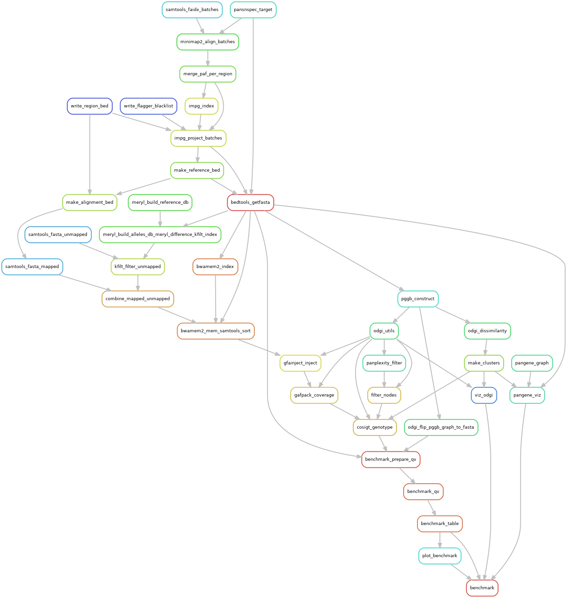

# Workflow

The [rulegraph](https://snakemake.readthedocs.io/en/stable/executing/cli.html) below illustrates a compact representation of the cosigt workflow:

[](./rulegraph.png)

::: warning
The rulegraph above is from an earlier release and does not yet show the unmapped-read rescue, the node-masking step, or the reworked benchmarking. Regenerate it for your configuration with `make run SMK_ARGS="--rulegraph" | dot -Tpng > rulegraph.png`.
:::

Cosigt assigns structural haplotypes to sequenced samples by combining pangenome graph construction with cosine similarity-based classification. For each sample and region of interest it identifies the haplotype combination — drawn from a given set of alleles — that best explains the structural composition of that region.

The logic reduces to four ideas:

1. **[Build a local graph](#graph-construction)** of the region from a panel of alleles, so that structural variation is represented as alternative paths rather than as differences from one linear sequence.
2. **[Describe every allele as a vector](#path-specific-node-coverage)** of how often its path traverses each node.
3. **[Describe the sample as a vector](#sample-specific-node-coverage)** in the same space, by realigning its reads to the alleles and projecting those alignments into the graph.
4. **[Match](#haplotype-deconvolution)** the sample vector against the sum of every candidate haplotype combination, and take the closest.

Everything else in the pipeline exists to make those four steps accurate: getting the right sequences into the graph, recovering reads that the linear reference loses, and discarding nodes that carry no signal.

## Pipeline at a glance

| Stage | Tool | Runs per |
| ----- | ---- | -------- |
| [Haplotype alignment](#haplotypes-alignment) | minimap2 | chromosome × assembly sample |
| [Target region liftover](#target-region-liftover) | impg | region |
| [Graph construction](#graph-construction) | pggb | region |
| [Structural clustering](#structural-clustering) | odgi, R | region |
| [Node masking](#node-masking) | panplexity, R | region |
| [Path coverage](#path-specific-node-coverage) | odgi | region |
| [Unmapped-read rescue](#unmapped-read-rescue) | meryl, kfilt | sample × region (`short` only) |
| [Reads-to-allele alignment](#reads-to-allele-alignment) | bwa-mem2 / bwa / minimap2 | sample × region |
| [Graph projection](#sample-specific-node-coverage) | gfainject, gafpack | sample × region |
| [Deconvolution](#haplotype-deconvolution) | cosigt | sample × region |

Only the last four scale with samples *and* regions, which is why they dominate the job count and are grouped together for cluster submission — see [Parallelisation](#parallelisation).

## Haplotypes alignment

The pipeline begins by aligning the assembled haplotypes (queries) to their corresponding reference genome (target) using [minimap2](https://github.com/lh3/minimap2). We use the `asm20` preset, as it is optimised for assembly-to-reference alignment and permits continuous alignment across segments when divergence does not exceed 20%, even within complex regions.

Alignment is done in batches, one per assembly sample, and the resulting PAFs are concatenated and indexed per chromosome so that the liftover step can query them.

::: tip
This whole stage is skipped when `allele_source: custom`, since the alleles for each region are then supplied directly and there is nothing to project. That is the cheapest way to genotype against a curated allele panel rather than a set of assemblies.
:::

## Target region liftover

Following the [initial alignment](#haplotypes-alignment), the workflow leverages an implicit pangenome graph model — implemented in [impg](https://github.com/pangenome/impg) — to lift over the coordinates of the regions of interest from the target sequence to the queries. This identifies the homologous *locus* on every haplotype that maps to a specified target region.

Raw projections are noisy, so three filters follow:

1. **Blacklisting.** Contigs overlapping an interval in the user-supplied `flagger_blacklist` are dropped. This is how you exclude assembly regions flagged as unreliable.
2. **Merging.** Blocks belonging to the same contig are merged when they fall within 200 kb of one another, so that a locus fragmented by a few alignment breaks is recovered as one interval.
3. **Flank spanning.** A merged block is kept only if it covers both the first and the last kilobase of the region. A haplotype that only partially overlaps the locus would otherwise contribute a truncated allele and distort the graph.

The surviving intervals define the allele set for the region.

## Graph construction

With the coordinates [established](#target-region-liftover), the pipeline extracts the corresponding sequences from both the target and the queries, then uses [pggb](https://github.com/pangenome/pggb) to construct a local pangenome graph.

In [previous work](https://www.nature.com/articles/s41586-024-07911-1) we found it beneficial to collapse regions with copy-number events into single regions of the graph, so `pggb` runs with `-c 2` by default. This is deliberate and central to how cosigt works: when a segment is present in two copies on one haplotype and three on another, collapsing them into a single node lets the *coverage* over that node carry the copy number, rather than forcing the graph to represent each copy as a separate path. The segment length `-s` is derived from the shortest sequence in the region so that it never exceeds it.

The graph is then sorted with the reference path as the anchor, so that node order follows reference order.

## Structural clustering

We identify structural clusters among the extracted haplotypes. Using the [pggb graph](#graph-construction) we compute a distance matrix between all haplotype pairs with [odgi](https://github.com/pangenome/odgi) `similarity` — the estimated difference rate ranges from `0`, identical node traversal, to `1`, completely disjoint paths — and cluster with [DBSCAN](https://en.wikipedia.org/wiki/DBSCAN).

`minPts` is always `1`. `eps` is chosen automatically: the pipeline scans a grid of candidate values and scores each resulting partition on silhouette width, [DBCV](https://doi.org/10.1137/1.9781611973440.96) and cluster separation, penalising partitions dominated by one giant cluster and those consisting mostly of ambiguous singletons.

Clusters serve two purposes. They summarise the major structural variants present at a locus, and they qualify each genotype call: two haplotypes from the same cluster are near-interchangeable, so a call that picks the wrong haplotype from the right cluster is a very different kind of error from one that picks the wrong cluster entirely.

Every knob is exposed under `cluster` in the configuration, and the step writes its diagnostics — the full eps scan, per-partition metrics, cluster summaries and medoids — alongside the assignments, so a questionable region can be inspected after the fact.

## Node masking

Not every node in the graph carries usable signal, and a node that attracts spurious alignments actively degrades the cosine similarity. Two masks are therefore combined before genotyping:

1. [panplexity](https://github.com/AndreaGuarracino/panplexity) marks **low-complexity** nodes, using a linguistic-complexity measure over a sliding window.
2. A coverage-outlier pass marks nodes whose coverage **across the graph's own paths** is anomalously high — typically collapsed repeats, where many haplotypes pile onto one node.

The union is handed to the genotyper, which excludes those nodes from every vector comparison.

## Path-specific node coverage

The workflow uses [odgi](https://github.com/pangenome/odgi) `paths` to compute the coverage of each path over the nodes in the [graph](#graph-construction):

1. If a path crosses a node once, its coverage over that node is `1`.
2. If a path does not cross a node, its coverage is `0`.
3. If a path loops over a node multiple times, its coverage is `>= 2`.

Point 3 is what makes copy number visible: combined with the `-c 2` collapsing above, a haplotype carrying three copies of a repeat unit registers as coverage `3` on the collapsed node rather than as a longer path.

## Reads-to-allele alignment

For each sample, reads spanning the regions of interest are fetched from the initial alignment to the linear reference and realigned against the corresponding allele blocks. Realigning against the alleles, rather than reusing the reference alignment, is what allows reads from a divergent haplotype to be placed correctly.

The aligner depends on `read_mode`:

| `read_mode` | Aligner | Rationale |
| ----------- | ------- | --------- |
| `short` | [bwa-mem2](https://github.com/bwa-mem2/bwa-mem2) `mem` | modern short reads |
| `ancient` | [bwa](https://github.com/lh3/bwa) `aln`/`samse` | ancient DNA parameters, `-l 1024 -n 0.01 -o 2`, as suggested in [this publication](https://onlinelibrary.wiley.com/doi/10.1002/ece3.8297) |
| `long:<preset>` | [minimap2](https://github.com/lh3/minimap2) | long reads; preset chosen per technology |

In all cases alternative alignment hits are retained, because a read from a repeat unit legitimately matches every copy and every haplotype carrying it. Discarding those would erase exactly the signal cosigt uses.

::: warning
Retaining multi-mappings against a panel where every locus repeats once per haplotype makes seed-occurrence counts very high, and bwa-mem2 can abort with an internal assertion as a result. The pipeline sets its seed-occurrence cap explicitly and halves it on each retry; see [`bwa-mem2.max_occ`](/configuration/configuration.html#resources).
:::

### Unmapped-read rescue

In `short` mode only, reads that failed to map to the linear reference are recovered rather than discarded. [meryl](https://github.com/marbl/meryl) counts the 31-mers present in the region's alleles but **absent from the reference**, and [kfilt](https://github.com/davidebolo1993/kfilt) selects unmapped reads carrying at least one of them. Those reads are realigned alongside the mapped ones.

This matters most for the haplotypes cosigt is most useful for: sequence that diverges enough from the reference that its reads do not place there at all would otherwise be invisible, biasing the sample vector toward reference-like alleles.

The rescue is deliberately skipped for `ancient` and `long:<preset>`, where per-read error rates make exact 31-mer matching an unreliable filter.

## Sample-specific node coverage

The [alignments](#reads-to-allele-alignment) are projected onto the graph using [gfainject](https://github.com/AndreaGuarracino/gfainject), and read coverage over the graph nodes is calculated with [gafpack](https://github.com/pangenome/gafpack). Two options matter here: `--len-scale` normalises coverage by node length, so that long nodes do not dominate, and `--weight-queries` divides a multi-mapping read's contribution across its alignments rather than counting it once per hit.

The result is a vector in the same space as the [path vectors](#path-specific-node-coverage), which is what makes the final comparison possible.

## Haplotype deconvolution

Finally, the sample's coverage vector is compared against candidate haplotype combinations built by summing [path](#path-specific-node-coverage) vectors. The comparison uses [cosine similarity](https://en.wikipedia.org/wiki/Cosine_similarity) — the dot product of two vectors divided by the product of their magnitudes — and the combination scoring highest is assigned as the genotype. Masked nodes are excluded from both vectors.

Cosine similarity is the right measure here because it is insensitive to overall magnitude: a sample sequenced at 10× and the same sample at 30× produce vectors pointing in the same direction with different lengths, and only the direction is informative about which haplotypes are present.

Candidates are combinations **with repetition** of size equal to the region's ploidy. A diploid region is scored over all `C(n+1, 2)` pairs — every heterozygous pair plus every homozygous one — and a region of ploidy *k* over all `C(n+k-1, k)` multisets. For haploid regions each individual path is compared directly.

::: tip
Enumerating with repetition matters beyond diploid. A triploid sample that is A/A/B can only be called correctly if partially homozygous combinations are among the candidates; scoring only the fully heterozygous and fully homozygous ones would miss it entirely.
:::

Each region yields the best genotype with its cosine similarity and the cluster of each predicted haplotype, plus the complete ranking of every scored combination, which is useful when the top two are close.

## Outputs

```txt
results/
├── cosigt/<sample>/<chr>/<region>/
│   ├── <region>.cosigt_genotype.tsv     best genotype, with clusters and similarity
│   └── <region>.sorted_combos.tsv.gz    every combination, ranked
├── cosigt/vcf/cosigt.vcf.gz             merged multi-sample VCF          (vcf: true)
├── cluster/<chr>/<region>/              assignments, medoids, diagnostics
├── odgi/viz/<chr>/<region>/             node-coverage plot               (odgi_viz)
├── pangene/viz/<chr>/<region>/          gene-order plot                  (pangene_viz)
├── benchmark/<mode>/                    QV tables and plots              (TARGET=benchmark)
└── metadata/                            per-region BEDs, normalised blacklist
```

The VCF represents each region as a single record whose `INFO/ALLELES` maps allele indices to haplotype names, with one symbolic `ALT` per alternate haplotype. It is produced for every `read_mode`.

Regions with ploidy above 2 are genotyped normally but skipped by the SVbyEye, svim-asm and benchmarking steps, which are diploid-only; the pipeline reports which regions were skipped rather than failing.

## Parallelisation

The pipeline parallelises at several levels:

1. [Haplotype alignment](#haplotypes-alignment) runs per chromosome and per assembly sample. Contigs must follow the [PanSN](https://github.com/pangenome/PanSN-spec) specification, and all haplotypes sharing an assembly sample identifier are aligned to their reference chromosome in one process.
2. [Liftover](#target-region-liftover) runs per region.
3. Graph operations run per region: [construction](#graph-construction), [clustering](#structural-clustering), [masking](#node-masking) and [path coverage](#path-specific-node-coverage).
4. Sample processing runs per sample and region: [rescue](#unmapped-read-rescue), [alignment](#reads-to-allele-alignment), [projection](#sample-specific-node-coverage) and [deconvolution](#haplotype-deconvolution).

Level 4 dominates, because it is the only one scaling with samples *and* regions. The total job count is roughly `7·S·R + 15·R + S`, so 500 samples over 100 regions is around 350,000 submissions — enough to overwhelm a scheduler queue on its own.

Those rules are therefore assigned to a Snakemake group, so each (sample, region) chain becomes one cluster submission instead of seven, and `--group-components` packs several chains into a single job. This changes nothing about the DAG, rule granularity or resumability. See [→ Configuration](/configuration/configuration.html#job-grouping-on-clusters) for how to tune it.
